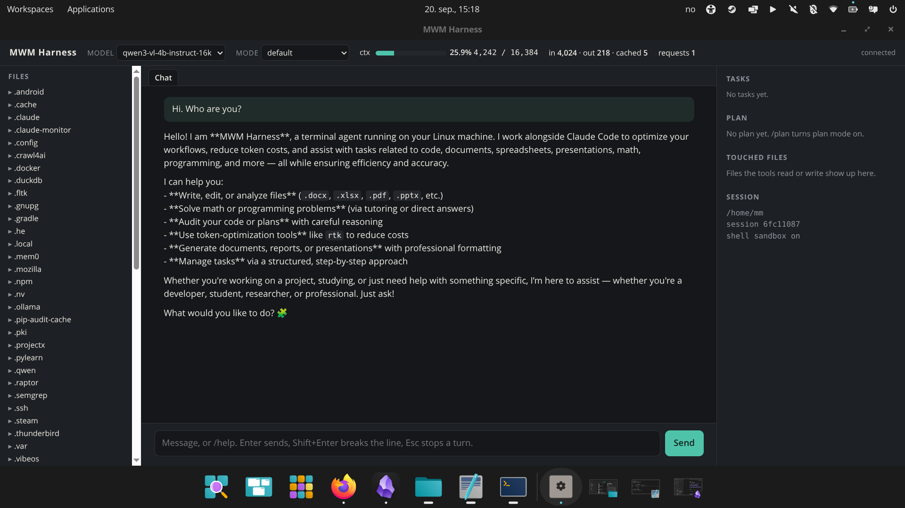

# MWM Harness



A personal agent harness for Qwen, Kimi and GLM models, in the mould of Claude
Code and Qwen Code: one core library, two thin front-ends on the same session.
`mwm --open` shows the browser panel above (files, code and diffs, tasks, plan,
token meter); `mwm` alone is a terminal prompt with the same slash commands.

> **Work in progress.** Phases 1 to 7 are built. The first runs against a live
> model happened on a local 4B model behind Ollama: it fixed a bug through
> Read, Edit and Bash behind approval prompts. The three hosted target models
> have not been run yet. The terminal front-end is a plain prompt today and is
> being rebuilt (phase 8). Nothing here is stable.

## Roadmap

Each phase closes on a test, not on a date.

| # | Build | Closed when |
|---|---|---|
| 0 | Spike: how each model streams tool calls on one OpenAI-compatible endpoint | 3 models each stream 2 parallel tool calls; token usage logged in `COMPAT.md` |
| 1 | Message model, session transcript, provider adapters | A recorded session replays cleanly through the transcript checks |
| 2 | Agent loop, file and shell tools, permissions, sandbox, cancel, plain terminal prompt | A model fixes a bug in a scratch repo behind approval prompts; Esc kills a long command |
| 3 | Hooks engine (scripts that run before and after tools and at end of turn), rules and memory injection | A hook can block a reply and the loop recovers |
| 4 | MCP client, web fetch and search, skills, slash-command files | Configured MCP servers list their tools and answer a call |
| 5 | Browser panels: chat, status bar with live context and token meter, tasks, plan, approval dialogs | Tasks tick live; context % equals the API usage numbers |
| 6 | File tree, open-files list, code viewer, diff before approval | Rejecting a diff leaves the file byte-identical |
| 7 | Subagents on a per-agent model, compaction, resume | A subagent on another model returns; a long session compacts and continues |
| 8 | Terminal front-end to the standard of Claude Code and Qwen Code: answers streamed as rendered markdown, a spinner with time and tokens, a framed input with history and slash completion, tool cards, coloured diff approvals, a status line | A bug-fix task reads like it does in those tools; every slash command works; the core and its tests are untouched |

Where each phase stands: 1 to 6 are closed. 0 is half closed: four local models
passed the parallel tool-call spike (`COMPAT.md`), the hosted models wait on a
key. 2 closed on a local model. 7 is built, its closing tests need a hosted
model. 8 has not started. The panel does not render markdown in answers yet.

## State

Every test runs without a network: a scripted provider plays the model, a fake
stdio server plays MCP, a mocked transport plays the web.

- `messages.py`, `transcript.py`: history and the session file use Anthropic-style
  content blocks (`text`, `tool_use`, `tool_result`), one JSON object per line.
  Conversion to the OpenAI wire format happens only for the outgoing request.
  `--resume` rebuilds a session from that file and repairs unanswered tool calls.
- `providers.py`, `streaming.py`: streaming client for any OpenAI-compatible
  `/chat/completions` endpoint; tool-call fragments are reassembled by index.
- `loop.py`: the turn state machine. Cancel keeps the partial answer and kills
  the running command's whole process group.
- `tools/`: `Bash`, `Read`, `Write`, `Edit`, `Glob`, `Grep`, `TodoWrite`. Names and
  argument names match Claude Code's, so existing hook matchers keep working.
- `permissions.py`: three modes (`default`, `acceptEdits`, `bypassPermissions`)
  and a hard deny list that no mode and no hook can lift (force-push, skipping
  commit hooks by flag or by `core.hooksPath`, recursive delete of `/` or home
  with `rm` or `find`, a decoded command piped into a shell, vector-database
  deletes, broker orders, a hand-curated notes folder). Broker and delete tools
  of MCP servers are matched on what the tool does, so renaming a server does
  not lift the rule. Reading is free inside the project and its read roots
  (the workspace, the scratch folder, `extra_writable`, `extra_readable`);
  anywhere else the person is asked. Key material (`~/.ssh`, `secrets.env`,
  `.aws`, `.gnupg`, `.netrc`, git and gh credentials) is denied for Read, Edit
  and Bash in every mode.
- `sandbox.py`: shell commands run inside bubblewrap when it is available: the
  filesystem is read-only outside the project and the session scratch folder,
  and an empty folder is mounted over `~/.ssh`, `~/.gnupg`, `~/.aws` and the
  harness's own config. It is a write boundary, not a network boundary. A
  command's environment carries no variable whose name looks like a secret
  (`bash_env_keep` exempts one); MCP servers keep their own keys and lose the
  model keys. When bubblewrap is missing the session says so at start instead
  of running bare in silence.
- `hooks.py`: reads Claude-Code-style `settings.json` files and runs their hook
  commands with the same stdin payload and the same answers (exit 2, `decision:
  block`, `additionalContext`, `updatedInput`, `permissionDecision`, PermissionRequest
  `behavior`, `async`). Eight events: SessionStart, UserPromptSubmit, PreToolUse,
  PostToolUse, PermissionRequest, Stop, PostCompact, SessionEnd. A Stop hook that
  blocks sends its reason back to the model; `stop_hook_active` is set on the retry.
  A PreToolUse `allow` does NOT skip the approval prompt unless
  `hooks_may_approve = true` is set, because a command-rewriting hook answers
  `allow` for everything it rewrites.
- `context.py`: system prompt from the rules files it finds (`CLAUDE.md`,
  `RULES.md`, `AGENTS.md`, with `@file.md` imports) plus the workspace memory
  index; the context meter reads the endpoint's own usage numbers.
- `mcp_client.py`: reads `.mcp.json` as Claude Code writes it (project, workspace,
  then `mcp.json` in the config folder) and offers each server tool to the model
  as `mcp__server__tool`. Two transports, no SDK dependency: stdio (one JSON-RPC
  message per line) and streamable HTTP (JSON or event-stream answers, session
  header). A server starts on its first call; the tool listing comes from a cache
  keyed on the server's configuration and its script's modification time. The
  per-server `timeout` of `.mcp.json` is honoured, a timeout or a cancel sends
  `notifications/cancelled`. Image results are saved to the scratch folder and
  named in the result. A tool marked `readOnlyHint` runs unasked; every other MCP
  tool asks, unless a pattern in `mcp_allow` covers it. The deny list still wins.
- `tools/web.py`: `WebFetch` (HTML to text with headings, lists and link targets;
  5 MB cap; each redirect hop re-checked; loopback and private addresses refused
  unless `web_allow_private = true`) and `WebSearch` (DuckDuckGo's HTML page, or
  the Brave API when `BRAVE_API_KEY` is set).
- `skills.py`: `SKILL.md` folders from `.claude/skills` (project, workspace, home)
  and from `skill_dirs`; the system prompt lists names and descriptions, the
  `Skill` tool loads a body. Command files (`.claude/commands/**/*.md`) become
  slash commands with `$ARGUMENTS` and `$1`..`$9` filled in.
- `repl/terminal.py`, `cli.py`: the `mwm` command. Slash commands: `/help /model
  /models /context /usage /mode /permissions /tasks /hooks /memory /mcp /skills
  /commands /plan /files /open /agents /compact /init /resume /clear /quit`, plus one per command file and per skill.
  `mwm -p "question"` runs one headless turn; `--no-mcp` and `--no-hooks` exist.
- `web/server.py`, `web/static/index.html`: the browser panel, `mwm --web`. One
  page, one websocket, the same `Session` as the terminal: chat with streamed
  text, tool cards, a status bar (model, permission mode, context share, tokens
  in, out and cached, request count), the task list ticking live, the last plan,
  and approval dialogs (`y`, `a`, `n`; Esc stops a turn). Slash commands work in
  the message box. The server binds to 127.0.0.1, refuses any `Host` header but
  its own, refuses a websocket from another `Origin`, and needs a per-launch
  token that travels in the address fragment, so it never reaches a log or a
  `Referer`. A page that opens late gets the history and any open approval.
  The API does not expose the plan's credit balance, so the bar counts requests.
- `preview.py` and the panel's file views: a file tree of the project, tabs of
  open files, a list of files the tools touched, and a read-only code viewer
  (Monaco 0.56.0 from jsdelivr, or from the machine itself after
  `mwm --vendor-monaco`, which downloads it once, checks a pinned sha512 and lets
  the panel drop the CDN from its content security policy; with neither, the
  page falls back to plain text). Before a `Write` or `Edit` is approved, its result is computed without
  touching the disk and shown as a side-by-side diff; the terminal prompt prints
  the same change as a unified diff. Browsing answers only for paths inside the
  project: `..`, absolute paths and symlinks that lead out are refused.
- `agents.py`: subagents. `agents/<name>.md` files (frontmatter `name`,
  `description`, `tools`, `model`, then the agent's system prompt) load from
  `.claude/agents` (project, workspace, home). The `Task` tool runs one as a child
  session: own history and transcript, only the tools its file lists (patterns
  such as `mcp__server__*` work), never `Task` itself, the parent's permission
  rules, approver and tool hooks, no Stop hooks. Only the final report returns.
  `agent_models` in `settings.toml` maps a file's `model:` word to a configured
  model (`opus = "qwen3.8-max"`); an unmapped word runs on the parent's model and
  says so. Stopping the parent turn stops the agent and kills its command.
- Compaction: at the model's soft budget (or on `/compact [focus]`) the model
  writes a summary that replaces the history; the `PostCompact` hooks fire with
  the summary; `--resume` starts from the last summary. A failed summary keeps
  the history. `auto_compact = false` switches the automatic part off.
- Plan mode (`/plan`, `--mode plan`): only reading tools run; the model hands in
  its plan with `ExitPlanMode`, and your yes returns to the mode you came from.
- `spike/panel_demo.py`: the panel with a scripted model, for a look without a key.
- `spike/real_agents_check.py`: loads the agent, skill and command files of this
  machine and lists tool names no harness tool or MCP server provides.
- `spike/real_mcp_check.py`: starts every configured MCP server, lists its tools,
  and sends one `search_knowledge` call through a real session.
- `spike/real_hooks_check.py`: runs a scripted turn through the hooks installed
  on this machine and reports which of them fired and blocked.

- `jev.py`, the `Judge` tool, `mwm-jev`: a second opinion from Jev, a model that
  returns typed decisions (a yes/no probability, one option of a closed set, a
  level on a scale) and no text. It is one extra vote beside other evidence,
  never the decider. Every call goes to an append-only log; the real result is
  recorded later and `mwm-jev report` gives the hit rate per domain and label,
  with a Brier score for yes/no questions. The tool asks for approval because
  the text it judges leaves the machine. Key: `TYPESAFE_API_KEY`.
- Loop guards found by the first live runs: a turn ends after 60 model requests
  (`max_requests_per_turn`); compaction keeps the prompt size right after a
  summary as a floor and waits for half a budget of growth, because a prompt
  whose fixed part is over the budget used to compact after every tool call; an
  `Edit` that cannot apply returns its error without asking the person first.

Run against a live model so far: the tool-call spike and a bug-fix task, on
local models only. Phase 7 closes when a subagent on another model returns and
a long session compacts at its budget and continues.

## Reviews

The code was written by a model, so it gets reviewed like code from a stranger.
A security review of the permission, sandbox, web and panel code found five
working bypasses (any file readable without a prompt, API keys in every shell
command's environment, two deny rules lifted by renaming an MCP server, `rm`
with long options, a silent no-sandbox fallback). All five are fixed and each
is a test in `tests/test_security_review.py`. Still open: `WebFetch` resolves
a host twice (a DNS-rebinding window), the sandbox has no network boundary, and
about half the code (`cli.py`, the terminal front-end, `skills.py`, the MCP
protocol handling) has had no review yet.

## Use

```bash
.venv/bin/mwm                     # interactive, in the current directory
.venv/bin/mwm --mode acceptEdits  # file edits inside the project run without asking
.venv/bin/mwm --resume last       # continue the newest session of this directory
.venv/bin/mwm --web               # browser panel on 127.0.0.1:8765 (needs the web extra)
.venv/bin/mwm --open              # the same, shown in its own browser window
.venv/bin/mwm --vendor-monaco     # once: fetch the code viewer for use with no network
.venv/bin/mwm -p "summarise README.md"
.venv/bin/mwm-jev report          # the judge's decision log and hit rate
```

Exit codes of `mwm`: 2 = no API key, 3 = any other configuration mistake
(unknown model, unknown agent).

### A local model

`models.toml` carries two entries for Ollama's OpenAI-compatible endpoint. Any
non-empty `OLLAMA_API_KEY` will do. Two things to know: Ollama cuts a prompt
that is longer than the model's context length without saying so, and its `/v1`
endpoint cannot raise that length per request, so build a variant once:

```bash
printf 'FROM qwen3-vl:4b-instruct\nPARAMETER num_ctx 16384\n' > Modelfile
ollama create qwen3-vl-4b-instruct-16k -f Modelfile
OLLAMA_API_KEY=ollama .venv/bin/mwm --model qwen3-vl-4b-instruct-16k --no-mcp --no-hooks
```

A 4B model on a laptop GPU is slow and loops on wrong edits; it is a way to
exercise the loop, not a way to work.

Optional files in `~/.config/mwm-harness/`: `settings.toml` (default model,
permission mode, sandbox, extra writable and readable paths, `bash_env_keep`,
`max_requests_per_turn`, hook settings files, `mcp_allow`, `mcp_files`,
`skill_dirs`, `web_allow_private`, `agent_models`),
`models.toml` (more models or another endpoint), `deny.toml` (extra deny rules),
`hooks.json` (hooks in the `settings.json` format).

## Reasoning playbooks, the critic, and the eval

A smaller model writes and debugs well and still misses what a careful reviewer
catches: a claim nobody ran, a search that came back empty for the wrong reason,
two changes credited to one. The harness carries that part as procedure.

- Four playbooks ship as skills and need no setup: `reason-predelivery` (grade
  every claim as ran / read / recalled / guessed before answering), `reason-debug`
  (reproduce, three hypotheses with a disproving check each, stop after two failed
  fixes), `reason-audit` (inventory and blast radius before judgement, findings
  with evidence, coverage count), `reason-challenge` (argue the other side, name
  the kill test, state confidence as a size). A skill of the same name in your
  own skill folders replaces the shipped one.
- The `critic` agent is a read-only second reader with a fixed five-question
  checklist and a `PASS | REVISE | BLOCK` verdict. It asks for the model tier
  `critic`; map it to another model family than the writer in `settings.toml`
  (`[agent_models]` `critic = "..."`), because a model that reviews its own work
  shares its blind spots. Unmapped, it runs on the parent model with a warning.
- `evals/cases.toml` holds 52 situations, each an ordinary request with one trap
  in its facts, all taken from real incidents and rewritten without names. Run:

```bash
.venv/bin/mwm-eval --model qwen3.8-max --arms bare,playbooks
.venv/bin/mwm-eval --model qwen3.8-max --arms critic --critic kimi-k2.7-code
.venv/bin/mwm-eval --model "cmd:some-cli -p" --judge glm-5.2   # any CLI that reads stdin
.venv/bin/mwm-eval --compare evals/out/*.jsonl
```

  Without `--judge` a regex grader runs: repeatable and offline, and crude (it
  can miss a correct reply worded unusually). With 52 cases the 95 % interval on
  a pass rate is about 13 points either side, so only large gaps mean anything.
  Single turn, no tools: it measures noticing, not agent behaviour.

## Setup

```bash
uv venv --python 3.12 .venv
uv pip install --python .venv/bin/python -e ".[dev]"
.venv/bin/pytest -q
```

## API key

The key never goes in this repo. Put it in `~/.config/mwm-harness/secrets.env`:

```bash
mkdir -p ~/.config/mwm-harness
printf 'MWM_HARNESS_API_KEY=%s\n' 'PASTE-KEY-HERE' > ~/.config/mwm-harness/secrets.env
chmod 600 ~/.config/mwm-harness/secrets.env
```

## Run the spike

```bash
.venv/bin/python spike/spike_toolcalls.py
```

It exits 2 when the key is missing or is a hostname, 1 when any model request
fails, 0 when every model answered. Raw chunks land in `spike/out/` (ignored by
git).
